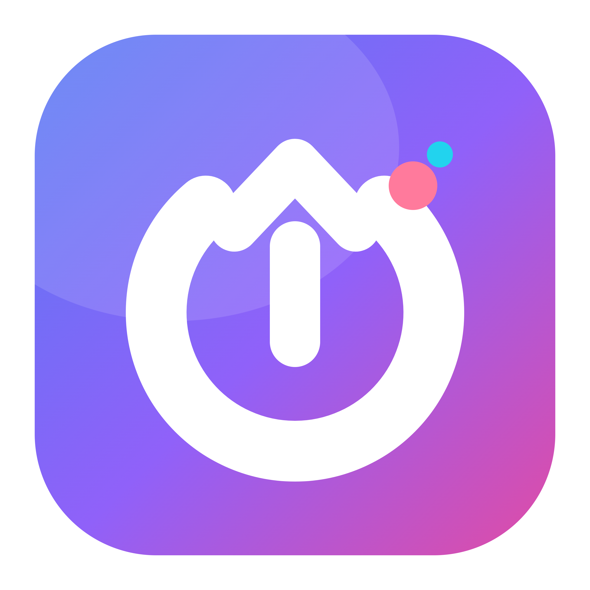
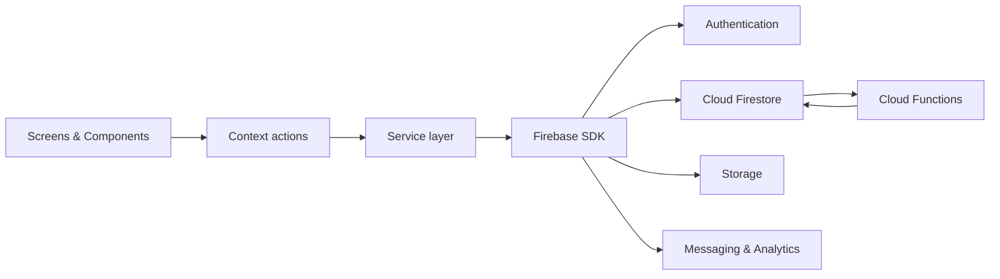

<p align="center">
  
</p>

<h1 align="center">CampusConnect</h1>

<p align="center">
  <strong>Kampüs iletişimi için geliştirilebilir React Native + Firebase uygulama temeli.</strong>
</p>

<p align="center">
  
  
  
  
  
</p>

> [!IMPORTANT]
> CampusConnect bitmiş veya production-ready bir sosyal ağ değildir. Repo; kapsamlı ekranlar, modüler uygulama katmanları ve Firebase entegrasyon kodu içeren, aktif geliştirme aşamasındaki bir MVP/başlangıç iskeletidir. Canlı davranışlar kendi Firebase projenizin yapılandırılmasına, security rules ve Cloud Functions deploy durumuna bağlıdır.

## Bu repo ne sunuyor?

CampusConnect; etkinlik, topluluk, kampüs marketi, mesajlaşma ve profil deneyimlerini tek mobil uygulamada birleştiren bir kod tabanıdır. Ancak amaç yalnızca belirli bir uygulamayı tamamlamak değildir: geliştiriciler modülleri çıkarabilir, birleştirebilir veya kendi kullanıcılarının iletişim biçimine göre yeniden tasarlayabilir.

Örneğin bu temel:

- yalnızca duyuru ve etkinlik odaklı bir kampüs uygulamasına,
- kulüp üyeliği ve özel topluluk akışına,
- gerçek zamanlı öğrenci mesajlaşma ağına,
- kampüs içi ikinci el pazarına,
- mentorluk, çalışma grubu veya mezun ağına

dönüştürülebilir. Ekran → Context → Service → Firebase sınırı, bu değişikliklerin bütün projeyi birbirine bağlamadan yapılabilmesi için korunur.


## Güncel proje özeti


| Alan | Kod durumu | Canlı çalışma koşulu |
| --- | :---: | --- |
| Uygulama kabuğu ve navigasyon | ✅ Mevcut | 6 ana tab, auth stack ve modül stack'leri kodda bağlı |
| Kimlik doğrulama | ✅ Mevcut | Firebase Auth ve kullanıcı profili için Firebase projesi gerekir |
| Discover ve etkinlikler | ✅ Mevcut | Firestore, Storage ve sayaç Functions deploy'u gerekir |
| Topluluklar | ✅ Mevcut | Açık üyelik ve özel katılım isteği akışları Firebase'e bağlıdır |
| Kampüs marketi | ✅ Mevcut | İlan verisi Firestore'a, fotoğraflar Storage'a bağlıdır |
| Mesajlaşma ve bildirimler | ✅ Mevcut | Realtime listener'lar ve mesaj trigger'ları Firebase'e bağlıdır |
| Profil, takip ve kaydedilenler | ✅ Mevcut | Firestore dokümanları ve takip Functions kaynakları kullanılır |
| Açık/koyu tema | ✅ Mevcut | Tercih AsyncStorage ile cihazda saklanır |
| Topluluk yorumları | ⚠️ Kısmi | Görsel alan var; yorum yazma alanı şu anda devre dışıdır |
| Firestore seed komutu | ❌ Eksik | `package.json` komutu var fakat `scripts/seedFirestore.js` repoda yok |
| Otomatik test | ⚠️ Düzeltilmeli | Jest, vector icon `.ttf` dosyası mock edilmediği için şu anda başarısız |
| Production/deploy doğrulaması | ⏳ Harici | Aktif Firebase projesi, servisler, plan ve deploy durumu doğrulanmalıdır |

### Kod seviyesinde bulunan başlıca akışlar

- Firebase email/password ile kayıt, giriş, şifre sıfırlama ve profil tamamlama,
- auth durumuna göre giriş veya ana uygulama navigasyonu,
- Firestore realtime etkinlik, topluluk, ilan, sohbet ve bildirim listener'ları,
- etkinlik oluşturma, kapak yükleme, katılma ve ayrılma,
- topluluk oluşturma, kapak/ikon yükleme, açık üyelik ve özel katılım isteği,
- topluluk gönderisi oluşturma ve gönderi/ilan kaydetme,
- çoklu fotoğraflı market ilanı oluşturma ve satıcıyla sohbet başlatma,
- birebir sohbet, mesaj gönderme, okunma durumu ve kullanıcı bildirimleri,
- profil düzenleme, avatar yükleme, takip/takipten çıkma ve bağlantı listeleri,
- kalıcı açık/koyu tema, bildirim tokeni yönetimi, çıkış ve hesap silme,
- ekran ve kullanıcı aksiyonu için Firebase Analytics çağrıları,
- sayaç ve bildirim işlemleri için 10 adet Cloud Functions trigger kaynağı.


### Auth

`Login`, `Register`, `ForgotPassword` ve `ProfileCompletion` ekranlarından oluşur. `AuthContext`, Firebase oturumunu dinler ve profil tamamlanmadan ana uygulamaya geçişi engeller.

### Hub ve Discover

Hub; kullanıcı, etkinlik ve topluluk özetlerini bir araya getirir. Discover; etkinlikleri ve popüler toplulukları gerçek zamanlı dinler, arama/kategori filtreleri sunar ve etkinlik detayına ya da oluşturma akışına yönlendirir.

### Communities

Listeleme, arama, filtreleme, öneriler, topluluk detayı, açık topluluğa katılma, özel topluluğa istek gönderme, topluluk oluşturma ve gönderi paylaşma akışlarını içerir. Gönderi kaydetme çalışacak biçimde bağlıdır; yorum oluşturma henüz uygulanmamıştır.

### Market

İlan listeleme, gelişmiş filtreler, ilan detayı, çoklu fotoğraf yükleme, ilan kaydetme, kullanıcının kendi ilanları ve ilan sahibine doğrudan mesaj gönderme akışlarını içerir.

### Chat ve Notifications

Kullanıcı sohbetlerini ve mesajları Firestore listener'larıyla dinler. Mesaj gönderme, sohbeti okundu işaretleme, bildirimleri listeleme ve özel topluluk katılım isteğini bildirim üzerinden onaylama/reddetme kodu bulunur.

### Profile ve Settings

Kullanıcının profilini, takipçilerini, takip ettiklerini ve diğer kullanıcı profillerini gösterir. Profil düzenleme, avatar yükleme, kaydedilen içerikler, tema, bildirim tokeni, çıkış ve hesap silme işlemlerine erişim sağlar.

## Mimari



Temel kural:

```text
Screen → Context action → Service → Firebase
```

- Ekranlar Firebase SDK'yı doğrudan çağırmaz.
- Context'ler ekranların kullandığı public action ve state'leri sunar.
- Service dosyaları okuma, yazma, listener ve upload işlemlerini taşır.
- Event, Community ve Market state'leri reducer ile yönetilir.
- Sayaç alanları client tarafından doğrudan değiştirilmez; Cloud Functions tarafından güncellenir.

## Proje yapısı

```text
CampusConnect/
├── android/                 # Android native proje
├── ios/                     # iOS native proje
├── src/
│   ├── assets/              # Logo, görseller ve gerçek tab ikonları
│   ├── components/          # 53 ortak/modül bazlı UI bileşeni
│   ├── constants/           # Route, koleksiyon, tema ve seçenek sabitleri
│   ├── context/             # 8 domain context'i ve AppProviders
│   ├── hooks/               # Ortak React hook'ları
│   ├── navigation/          # Auth, tab ve modül stack'leri
│   ├── reducers/            # Events, Communities ve Market reducer'ları
│   ├── screens/             # 8 alana ayrılmış 27 ekran
│   ├── services/            # 8 servis modülü ve Firebase gateway
│   └── utils/               # Filtreleme, doğrulama ve formatlama yardımcıları
├── functions/               # 10 Firestore tabanlı Cloud Functions trigger'ı
├── docs/                    # Tasarım, kurallar, index ve güvenlik planları
├── firestore.rules          # Firestore güvenlik kuralları
├── firestore.indexes.json   # Bileşik index tanımları
├── storage.rules            # Storage güvenlik kuralları
├── firebase.json            # Firebase deploy yapılandırması
└── App.js                   # Provider, navigation ve analytics girişi
```

## Teknoloji yığını

- React Native `0.86.0` ve React `19.2.3`
- React Navigation `7`
- React Native Firebase: App, Auth, Firestore, Storage, Messaging ve Analytics
- AsyncStorage, React Native Maps ve React Native Image Picker
- React Native SVG, Linear Gradient ve vector icons
- Firebase Cloud Functions v2
- Jest, React Test Renderer, ESLint ve Prettier

## Kurulum

### 1. Gereksinimler

- Node.js `22.11.0` veya üzeri,
- npm,
- hedef platform için hazırlanmış [React Native geliştirme ortamı](https://reactnative.dev/docs/set-up-your-environment),
- Android için Android Studio ve SDK,
- iOS için macOS, Xcode, Ruby/Bundler ve CocoaPods,
- Firebase CLI ve kullanabileceğiniz bir Firebase projesi.

### 2. Bağımlılıkları yükleyin

```bash
git clone https://github.com/yunussfr/CampusSocial.git
cd CampusSocial
npm install
npm --prefix functions install
```

### 3. Firebase projesini bağlayın

Firebase Console'da en az şu servisleri hazırlayın:

- Email/Password Authentication,
- Cloud Firestore,
- Cloud Storage,
- Cloud Messaging,
- Analytics,
- Cloud Functions için gerekli proje planı ve Google Cloud servisleri.

Native yapılandırma dosyalarını yerel olarak ekleyin:

```text
android/app/google-services.json
ios/GoogleService-Info.plist
```

Android dosyası `.gitignore` içindedir. iOS dosyasını da Git'e eklemeyin. `.env.example`, yerel proje bilgileri ve ileride geri eklenebilecek admin seed akışı için referans dosyasıdır; React Native Firebase'in native config dosyalarının yerine geçmez.

### 4. Firebase rules, index ve Functions kaynaklarını deploy edin

```bash
firebase login
firebase use --add
firebase deploy --only firestore:rules,firestore:indexes,storage
firebase deploy --only functions
```

> [!NOTE]
> Repoda rules, indexes ve Functions kaynakları vardır; belirli bir Firebase projesine başarıyla deploy edildikleri yalnızca kaynak koddan doğrulanamaz.

### 5. Uygulamayı çalıştırın

```bash
npm start
```

İkinci bir terminalde:

```bash
# Android
npm run android

# iOS
cd ios
bundle install
bundle exec pod install
cd ..
npm run ios
```

## Firestore modeli

Ana koleksiyonlar:

| Koleksiyon | Amaç |
| --- | --- |
| `users` | Profil, sayaç, FCM tokeni ve kullanıcı bilgileri |
| `events` | Etkinlik, tarih, konum, kapasite ve organizatör verisi |
| `communities` | Topluluk, gizlilik, medya ve üyelik bilgileri |
| `listings` | Market ilanı, fotoğraf, fiyat ve satıcı snapshot'ı |
| `chats` | Katılımcılar, son mesaj ve okunmamış sayaçları |

Önemli alt koleksiyonlar:

```text
events/{eventId}/attendees
communities/{communityId}/members
communities/{communityId}/joinRequests
communities/{communityId}/posts
chats/{chatId}/messages
users/{userId}/notifications
users/{userId}/saves
users/{userId}/follows
```

## Cloud Functions

| Trigger | Görev |
| --- | --- |
| `onEventJoin` / `onEventLeave` | Etkinlik katılımcı sayacını günceller |
| `onCommunityJoin` / `onCommunityLeave` | Topluluk üye sayacını günceller |
| `onMessageSent` | Son mesajı, okunmamış sayacı ve bildirimi günceller |
| `onListingSave` | İlan kaydetme sayacını günceller |
| `onCommunityJoinRequestCreated` | Topluluk sahibine istek bildirimi oluşturur |
| `onCommunityJoinRequestUpdated` | Onay/red sonucunu üyeliğe ve bildirime yansıtır |
| `onUserFollow` / `onUserUnfollow` | Takip sayaçlarını ve takip bildirimini yönetir |

## Kalite durumu ve bilinen eksikler

Bu bölüm güncel kaynak kodu olduğundan daha tamamlanmış göstermemek için özellikle tutulur.

| Kontrol | Güncel sonuç |
| --- | --- |
| `npm run lint` | ✅ 0 hata, 28 uyarı |
| `npm test -- --runInBand` | ❌ Vector icon `.ttf` dosyası için Jest mock eşlemesi eksik |
| Android/iOS cihaz testi | ⏳ Bu README güncellemesinde bağlı cihaz bulunmadığı için çalıştırılmadı |
| Firebase canlı akışları | ⏳ Yerel config ve deploy edilen Firebase projesiyle doğrulanmalı |

Bilinen geliştirme alanları:

- `PostDetailScreen` yorum alanı görsel olarak mevcut fakat `editable={false}` durumunda.
- `npm run seed:firestore`, repoda bulunmayan `scripts/seedFirestore.js` dosyasını çağırıyor.
- Jest için vector icon font dosyalarının mock veya `moduleNameMapper` ayarı tamamlanmalı.
- Lint uyarılarının çoğu inline style ve render içinde component tanımı kaynaklı.
- Gerçek cihaz ekran görüntüleri henüz repoya eklenmemiştir.
- Açık kaynak kullanım koşullarını belirleyen bir `LICENSE` dosyası henüz yoktur.

## Projeyi kendi iletişim modelinize uyarlama

| İhtiyaç | Tutulabilecek modüller | Sadeleştirilebilecek alanlar |
| --- | --- | --- |
| Duyuru ve etkinlik uygulaması | Auth, Discover, Events, Notifications | Market ve birebir chat çıkarılabilir |
| Kulüp/topluluk platformu | Auth, Communities, Posts, Membership | Market isteğe bağlı tutulabilir |
| Kampüs marketi | Auth, Market, Saved, Chat | Events ve Communities azaltılabilir |
| Mesajlaşma ağı | Auth, Hub, Chat, Notifications, Profile | İçerik modülleri ayrılabilir |
| Mentorluk/çalışma grubu | Profile, Follow, Communities, Chat | Veri modeli eşleşme mantığıyla genişletilebilir |

Yeni bir modül eklerken önerilen sıra:

```text
Route → Context action → Service → Screen → Firebase rules → Test
```

## Proje belgeleri

- [Geliştirici kuralları ve fazlar](./docs/developer_rules.md)
- [Figma ekran gereksinimleri](./docs/FIGMA_SCREEN_REQUIREMENTS.md)
- [Cloud Functions planı](./docs/CLOUD_FUNCTIONS_PLAN.md)
- [Firestore bileşik index planı](./docs/COMPOSITE_INDEX_PLAN.md)
- [Security rules taslağı](./docs/SECURITY_RULES_DRAFT.md)
- [Firebase seed rehberi](./docs/FIREBASE_SEED_GUIDE.md) — mevcut seed script repoda olmadığı için rehber tek başına çalıştırılabilir değildir.

## Katkıda bulunma

Katkı gönderirken:

1. Değişikliğin çözdüğü iletişim ihtiyacını açıklayın.
2. Screen → Context → Service → Firebase sınırını koruyun.
3. Firebase çağrılarını ekran bileşenlerinin içine taşımayın.
4. Yeni veri alanları için rules ve index etkisini kontrol edin.
5. Yeni veya değişen ekran için gerçek cihaz görüntüsünü README'ye ekleyin.
6. Yerel config, servis hesabı, token veya imzalama bilgisi commit etmeyin.

---

<p align="center">
  <strong>CampusConnect tamamlanmış bir kalıp değil; farklı kampüslerin kendi iletişim biçimlerini inşa edebileceği modüler bir başlangıçtır.</strong>
</p>
